# Migrating the remote-claw viewer to Astryx

A running, evidence-based log of moving `apps/web` (a Next.js 16 / React 19 chat-transcript viewer for
remote Claude Code sessions — dark-only when the migration began, now light **and** dark) onto
**[Astryx](https://astryx.atmeta.com)** — Meta's MIT-licensed React design system,
`@astryxdesign/core@0.1.8` (public beta).

It is written to be **shareable with the Astryx developers**: everything below is something we actually
hit, with the evidence that proves it, not an impression. Findings are added as the migration proceeds.

- **Our stack:** Next.js 16.2.7 App Router, React 19.2.7, **webpack** (`next build --webpack`), pnpm 10
  strict `node_modules`, TypeScript strict (`noUncheckedIndexedAccess`, `exactOptionalPropertyTypes`,
  `verbatimModuleSyntax`), Biome, Playwright, a strict CSP (`style-src 'self' 'unsafe-inline'`,
  `font-src 'self'`, `connect-src 'self'`).
- **Starting point:** one 2 504-line `page.tsx` and a hand-written 1 567-line stylesheet.
- **Constraint that shaped everything:** ~130 Playwright locators target the viewer's own CSS classes,
  so the migration had to be incremental rather than a rewrite.

---

## Status

**A note on an earlier overclaim:** a previous revision called the migration "complete" after the
buttons, prose and dot. That was premature — a whole class of surfaces hadn't been assessed, and the
sheet/session rows were written off as "bespoke" without the work. Every remaining surface has since been
assessed against the SHIPPED package source (not the docs); the results are the KEEP table in finding M
and finding N (where the `Dialog` swap was investigated, reproduced, and dropped). Every "Kept" below names a specific blocking fact.

| Surface | State | Detail |
| --- | --- | --- |
| Cascade layers, brand theme, build, CSP | **Astryx** | `Theme`, `defineTheme`, `astryx theme build` |
| Colour mode (light / dark / system) | **Astryx** | `[light, dark]` tuples → `light-dark()`; `<Theme mode>` + `data-theme`; topbar toggle |
| Entry screens (Connect / Pairing / splash) | **Astryx** | `Card` `VStack` `Heading` `Text` `TextArea` `Button` `Banner` `Code` `Spinner` |
| Composer controls (Send / Mode / attach) | **Astryx** | `Button` `IconButton` |
| Permission + question actions | **Astryx** | `Button` (green/red tint kept — finding L) |
| Chrome actions (Forget, back, ⋯, jump, retries, dismiss, remove) | **Astryx** | `Button` `IconButton`; armed Forget → `destructive` |
| Transcript prose | **Astryx** | `Markdown` — replaced `react-markdown` + `remark-gfm` |
| Session connection dot | **Astryx** | `StatusDot` (`variant` + `isPulsing`) |
| Error banners (broker-unreachable, send-failed) | **Astryx** | `Banner` (`status` → `role`, real dismiss) |
| "needs you" session badge | **Astryx** | `Badge` (`variant="warning"`) |
| Composer text input | **Kept** | finding I — `ChatComposerInput` hard-codes Enter→send |
| Question answer options | **Kept** | finding J — `SelectableCard` is a padded card, not a compact toggle |
| Transcript message rows | **Kept** | finding K — the transcript is an asymmetric document, not symmetric chat |
| Bottom-sheet shell (scrim/focus-trap) | **Kept** | finding N — `Dialog`'s benefit (scroll-lock) is a non-bug here; verified on Chromium + WebKit |
| Session row, sheet rows, expandable rows, diff, tool output, other badges, status strip, empty states | **Kept** | hard functional blockers — see the KEEP table in finding M |

**12 Astryx components, 44 usages.** Raw `<button>` in `page.tsx`: **17 → 9**, and the nine left are the
four sheet rows, one question option, the session row and the scrim — all in the "kept" rows above.
`viewer.css` shrank by ~1 100 lines net across the migration.


---

## What works well

**1. The published package really is build-step-free on Next.js + webpack.**
Three CSS imports and one provider, exactly as documented, and it built first try. No Babel, no PostCSS,
no StyleX compiler, no `next.config` change. Given `astryx docs styling` describes Next.js App Router as
"the sharp edge" for StyleX, it is worth stating plainly in the Quick Start that *consumers who don't
author StyleX never touch that path at all* — we only learned it was a non-issue by reading further.

**2. `BaseProps` keeping `className`, `style`, `id`, `data-*` and `aria-*` is what made this possible.**
An incremental migration of an app with ~130 CSS-selector-based browser tests is only feasible because
components forward these. A system that only accepted `xstyle` would have forced a big-bang rewrite of
the app *and* its test suite in one commit. This deserves to be advertised louder than it is — it is
arguably the single most important adoption property.

**3. The CLI is a better documentation surface than the website, and should be the headline.**
`astryx docs <topic>`, `astryx component <Name>`, `astryx hook`, `astryx template`, plus `--json` and
`--dense`, gave complete, offline, machine-readable docs. We started by fanning out ~240 agents to scrape
`astryx.atmeta.com`; we threw that away once we found the CLI, which was both more accurate and free. The
docs site is a Next.js app whose content is inside an RSC payload, so it fetches poorly — the CLI has no
such problem.

**4. `astryx docs migration` predicted our worst bug before we hit it.**
Its "Cascade Layer Safety" section describes exactly the failure we then walked into (see finding **B**),
including the webpack `@import`-hoisting caveat and the `layers.css` remedy. Docs that name the specific
silent failure mode of the specific bundler are rare and valuable.

**5. `defineTheme` is expressive enough to carry a brand across without fighting it.**
The whole palette — near-black surface stack, two-value accent, status colours, type families — is 60
lines of `defineTheme` extending `neutralTheme`, and `astryx theme build` turns it into a static CSS file
that ships the tokens on first paint. The one place it surprised us is how the accent scale behaves in
dark mode (finding **F**), and even that had a documented escape hatch.

**6. `Markdown` replaced two dependencies and came with the guarantees we'd hand-wired.**
We dropped `react-markdown` + `remark-gfm` for Astryx's `Markdown`. It escapes raw HTML to text (no
`dangerouslySetInnerHTML`, no raw-HTML path) and applies `rel="noopener noreferrer"` itself — the exact
two properties our transcript needs, since it renders untrusted model output and we'd previously wired
both by hand. It also wraps tables in a horizontal scroller and renders fenced code as a real `CodeBlock`,
both of which we'd hand-rolled. The swap was gated on our existing security contract and passed unchanged.

The rest of the Chat family didn't fit our asymmetric transcript (finding **K**) — but `ChatToolCalls` is
genuinely close to a tool-call row and is worth knowing about on its own.

**7. CSP-clean out of the box.**
`reset.css`, `astryx.css` and the built theme CSS contain no `@font-face`, no `@import`, and no remote
`url()`. Under `font-src 'self'` / `default-src 'self'` that matters, and a theme package that pulled a
webfont would fail only on a real device. We now assert it in a test.

**8. `astryx docs layout` archetypes are good design advice, not filler.**
"Messaging / feed → rows and bubbles, no cards in the stream" matched the layout we had already arrived
at independently, which raised our confidence that adopting the system wouldn't fight the product.

**9. `TextArea`'s iOS auto-zoom guard is pointer-aware, which is better than what we had.**
Astryx ships `@media (pointer: coarse) { font-size: max(1rem, var(--text-body-size)) }`. Our own rule
pinned the field to 16px unconditionally, which is heavier than it needs to be on a desktop. Same
protection where it matters (iOS only auto-zooms a sub-16px field), denser everywhere else.

**10. Three of our hand-tuned design/a11y assertions passed against Astryx components unchanged.**
This is the strongest evidence we have that the defaults are considered. All three were written as
regression guards against real bugs we had shipped, and all three still pass with the hand-written CSS
deleted:

| Our guard (written before Astryx existed for us) | Astryx component | Result |
| --- | --- | --- |
| Disabled primary CTA must stay a dimmed accent fill (`opacity: 0.5`, non-transparent background), not a dead grey slab | `Button variant="primary" isDisabled` | passes unchanged |
| The pass field must be ≥16px so iOS Safari doesn't auto-zoom on focus (we deliberately allow pinch-zoom, so font size *is* the guard) | `TextArea` | passes unchanged |
| The connect gate must autofocus its single field | `TextArea hasAutoFocus` | passes unchanged |

`Button`'s `isLoading` was also a straight upgrade: we used to swap the label to "Connecting…", which
changes the accessible name mid-flight. `isLoading` keeps the name stable and adds a spinner plus
`aria-busy`.

**11. Light mode fell out of the theme's `[light, dark]` tuples almost for free.**
The viewer shipped dark-only for a long time, but `defineTheme` had carried a `[light, dark]` tuple for
every token all along (kept legible against a future light mode). Turning it on was three things: verify
the light half (WCAG AA + screenshots in both modes); mirror the same light/dark pairs into the handful of
hand-written `viewer.css` tokens that Astryx doesn't own, as CSS `light-dark()` — which resolves off the
very `color-scheme` that Astryx's `reset.css` derives from `<html data-theme>`, so the two systems flip in
lockstep with **no second switch to maintain**; and add a `system`-default preference with a toggle. Two
edges worth flagging for the roadmap: (a) `<Theme mode="system">` pins `color-scheme: light dark` on its
wrapper, so you can't drive a forced mode purely from `<html data-theme>` while leaving `mode="system"` —
the provider's `mode` prop must be the source of truth, which for flash-free SSR means the server has to
know the preference (we read a cookie; a documented "SSR the mode" recipe would help). (b) The provider is
a client component, so its exported helpers can't be called from a server layout — worth a note that
cookie/`data-theme` plumbing belongs in a directive-free module. Net: the token model is the right shape,
and the component layer needed zero changes to support a second surface.

| light (the newly-verified surface) | dark (unchanged — the dark half of every `light-dark()`) |
| --- | --- |
| 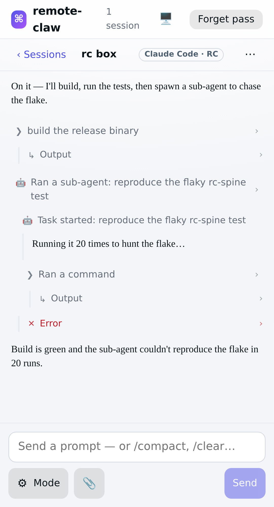 | 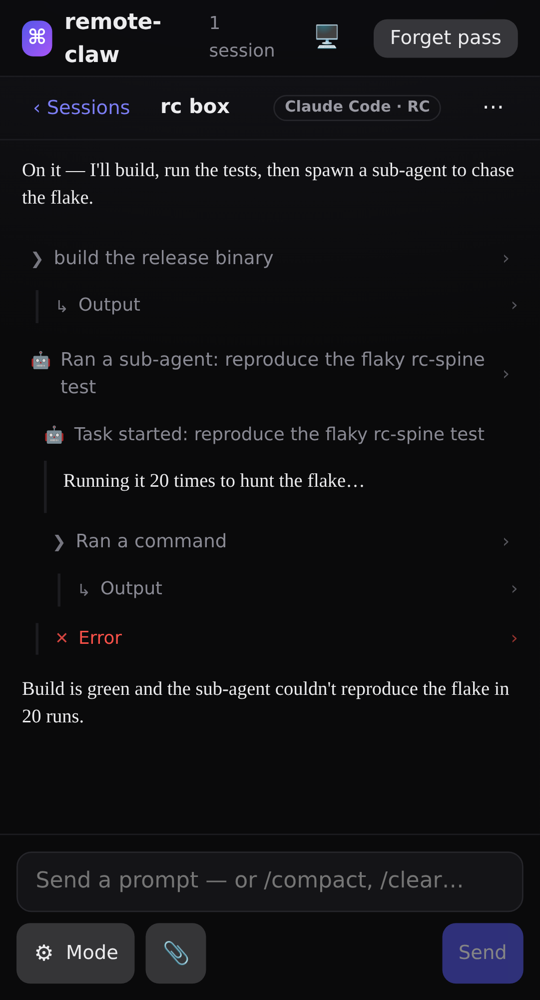 |

The semantic tints track the mode too — the permission card keeps its amber "action-required" border and
warm tint, with a darkened green Allow, on the light surface:

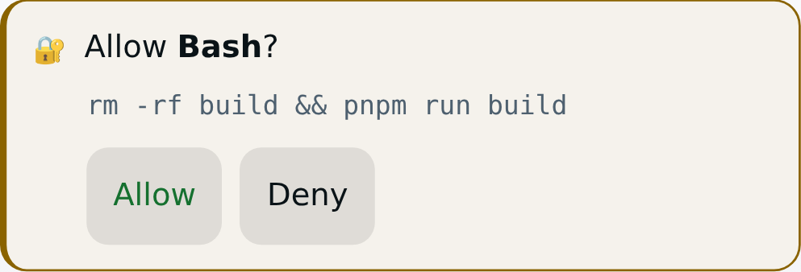

---

## Problems and friction

Ordered by how much time each cost us.

### A. `@stylexjs/stylex` is missing from the install instructions — hard runtime failure on pnpm

`README.md` Quick Start and `astryx docs getting-started` both say:

```bash
npm install @astryxdesign/core @astryxdesign/theme-neutral
```

But `@stylexjs/stylex` is a **peer dependency** of `@astryxdesign/core`, and **202 files in `dist/`
import it at runtime**:

```bash
$ grep -rl "@stylexjs/stylex" node_modules/@astryxdesign/core/dist --include="*.js" | wc -l
202
```

npm and yarn auto-install peer dependencies, so this is invisible there. **pnpm does not**, and pnpm's
strict `node_modules` means the package is genuinely unreachable — every component throws on import.

**Suggested fix:** add `@stylexjs/stylex` to the documented install line, or move it from
`peerDependencies` to `dependencies` (consumers who don't author StyleX have no reason to control its
version). A note in `astryx doctor` would also catch it.

### B. `@import "…" layer(name)` is silently dropped by Next.js's CSS pipeline

This is the one that actually broke us, and it is the exact failure class `astryx docs migration` warns
about — so it is worth the docs naming it explicitly.

We wrote the documented shape:

```css
/* app/globals.css */
@import "./layers.css";                 /* @layer reset, astryx-base, astryx-theme, remote-claw; */
@import "@astryxdesign/core/reset.css";
@import "@astryxdesign/core/astryx.css";
@import "./theme/built/remote-claw.css";
@import "./viewer.css" layer(remote-claw);   /* ← our 1567-line legacy stylesheet */
```

Next 16 inlines `viewer.css` but **discards the `layer()` function**, so the whole legacy stylesheet ships
**unlayered** — where it beats every cascade layer. There is no error and no warning, and the page *looks*
correct, because unlayered CSS winning happens to be what we wanted on day one. The layer we believed we
were in simply did not exist, and every later "did this component's styles take effect?" question would
have had a wrong answer.

Verified against the built artifact, not the source:

```js
// .next/static/css/*.css  — before the fix
"@layer remote-claw{".indexOf → -1        // the layer never opens
".q-freeform".indexOf        → 29843      // …but our rules are all there, unlayered
```

**Workaround:** put the layer *inside* the file. A file-internal `@layer name { … }` block survives the
pipeline intact (it is how `astryx.css` itself ships):

```css
/* app/viewer.css */
@layer remote-claw {
  :root { … }
  /* … */
}
```

**Why this matters beyond us:** the documented Tailwind-coexistence recipe in `astryx docs migration` and
`astryx docs styling` is built entirely on `@import "tailwindcss/preflight.css" layer(base)` and
`@import "tailwindcss/utilities.css" layer(utilities)`. On Next.js + webpack those appear to have the same
problem, which would put Tailwind preflight *above* `astryx-theme` — the precise silent override the doc
tells you to avoid. Worth verifying on your side and documenting the Next.js-specific shape.

We now guard it with a test that asserts on the **emitted** CSS; a source-level assertion passes in both
the broken and the fixed state.

### C. `astryx theme build`'s DEFAULT output location is a trap on a `.ts` source (but `--out` fixes it)

*Corrected during review — an earlier draft of this report called it a defect. It isn't; `--out` covers
it. The trap is only in the default.*

```bash
$ astryx theme build app/theme/remote-claw.ts
# → app/theme/remote-claw.css, remote-claw.js, remote-claw.d.ts, remote-claw.variants.d.ts
```

The built module lands beside its own source with the same basename, so `remote-claw.js` and
`remote-claw.ts` end up in one directory. Our `next.config.ts` sets
`extensionAlias: { ".js": [".ts", ".tsx", ".js"] }` (unrelated — it exists so a workspace package's
raw-TypeScript exports resolve), which tries `.ts` **first**. So
`import { remoteClawTheme } from "./theme/remote-claw.js"` resolves to the **source** theme — the
runtime-`<style>`-injection path — instead of the built one. Silently: same export name, same shape, just
without `__built: true`. A bare extensionless import is ambiguous under normal webpack
`resolve.extensions` ordering too.

`--out` is the answer, and it does more than its name suggests: it names the CSS path but relocates the
**entire** artifact set, because the CLI derives the `.js`/`.d.ts`/`.variants.d.ts` paths from its
dirname. Verified — all four land in the target directory and nothing is left beside the source:

```bash
$ astryx theme build app/theme/remote-claw.ts --out app/theme/built/remote-claw.css
$ ls app/theme/built
remote-claw.css  remote-claw.d.ts  remote-claw.js  remote-claw.variants.d.ts
```

**Suggested docs change:** `astryx theme build --help` describes `-o, --out` as "Output CSS file path",
which reads as CSS-only and is why we initially wrote a script to move the other three by hand. Saying
"output directory for all theme artifacts (named by the CSS path)" would have saved that entirely. A
line in `astryx docs theme` warning that the default co-locates a `.js` beside a `.ts` source would help
too — it is fine for a `.js`/`.mjs` theme source and a footgun for a `.ts` one.

### D. Generated artifacts carry a timestamp, so committed output can't be drift-checked

Every emitted file starts with:

```
 * Generated: 2026-07-23T14:28:08.031Z
```

We commit the built theme so CI and Vercel never have to run the CLI. With the timestamp, **every rebuild
produces a diff**, which makes the artifacts unreviewable and makes a "did someone edit the built file
instead of the source?" CI gate impossible. We post-process the line away to get byte-identical rebuilds.

**Suggested fix:** drop the timestamp (the `Source:` and `Command:` lines already carry the useful
provenance), or gate it behind a flag. Reproducible generated output is worth a lot.

### E. The `astryx init` nudge is printed on stdout of every command

```bash
$ astryx docs theme | head -2

Next step: run `pnpm exec astryx init` to finish setup and install the Astryx agent prompt.
```

That line is prepended to the stdout of `docs`, `component`, `hook` and `template`, so anything that pipes
or captures CLI output has to strip it. (`--json` is clean, which is the right instinct — the same should
apply to the text output.)

**Suggested fix:** send the nudge to **stderr**. It stays visible to a human, and disappears from pipes.

### F. `defineTheme`'s accent scale INVERTS the accent in dark mode — and no test caught it

Seeding the accent family the documented way:

```ts
defineTheme({ name: 'remote-claw', extends: neutralTheme, color: { accent: '#5457e8' } })
```

generates:

```js
"--color-accent":    "light-dark(#424BDA, #CBBEFF)"
"--color-on-accent": "light-dark(#FFFFFF, #001F9C)"
```

In **dark** mode the accent becomes a pale lavender **surface** carrying **dark** text. That is a
coherent convention, and for a system default it is probably the right one. But it is a surprise when the
reason you are writing a theme is to *carry an existing brand across*: our primary action is a solid
indigo fill with white text, and that exact pair was measured at 5.38:1 for WCAG AA. The generated theme
silently replaced both halves.

**What makes this worth reporting is how it was caught.** Our full gate stayed green — 339 unit tests and
36 Playwright tests, including a bespoke design guard that asserts the disabled primary CTA is a *dimmed
non-transparent fill* rather than a grey slab. That guard passed, because it asserts the treatment, not
the hue. Only a screenshot showed it.

| before — the generated accent | after — both halves pinned |
| --- | --- |
| 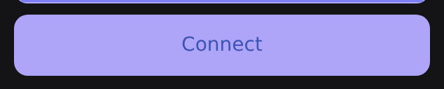 | 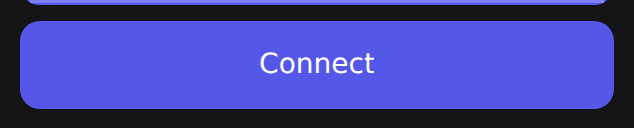 |

The fix is supported and documented ("explicit token overrides always take precedence over
scale-generated values") — pin **both** halves, never just one:

```ts
tokens: {
  '--color-accent':    ['#5457e8', '#5457e8'],
  '--color-on-accent': ['#ffffff', '#ffffff'],
}
```

**Suggested docs change:** `astryx docs theme` explains how to *seed* an accent and warns against
hand-writing `--color-accent` alone. It would help to also say, in the same place, that the seed
**inverts for dark mode**, and show this pin-both-halves snippet as the supported way to keep a fixed
brand fill. Right now the only warning points the other way, which nudges you toward the scale API and
away from the thing you actually need.

### G. Focus rings come from `--color-accent`, which fights a pinned brand fill

Following on from **F**: once you pin `--color-accent` to a brand *fill*, you also change every focus
indicator, because `astryx.css` draws them as:

```css
:focus-visible { outline: 2px solid var(--color-accent); }
```

There is no separate focus token. So a theme whose accent is a dark, saturated fill (correct for
white-on-accent buttons) gets a dark, low-contrast ring on a dark background — for us ~3.4:1 instead of
the 5.8:1 our `--color-text-accent` would give. It still clears the 3:1 that WCAG 2.2 SC 1.4.11 asks of a
non-text indicator, so nothing is *broken*; it is just dimmer than intended, and invisible until someone
tabs through the app on a dark theme.

We keep an app-level `:focus-visible` rule in the last cascade layer to hold the brighter colour, with a
Playwright assertion on the computed `outline-color` so it can't be deleted as part of "finishing the
migration".

**Suggested fix:** a dedicated `--color-focus-ring` token defaulting to `--color-accent`. Themes that
need a fill and a ring to differ (any dark theme with a saturated brand colour) could then set it,
instead of overriding component styles or re-declaring the rule outside the system.

### H. `<Text size>` is silently inert whenever the theme styles that `type`

`Text` documents `size` as an "explicit font size override… overrides the size from `type` but preserves
other type properties". On a themed app it does nothing for any `type` the theme emits a rule for:

```tsx
<Text type="supporting" size="xsm">…</Text>
// rendered: class="astryx-text supporting xsm secondary …"
// computed: font-size: 12px   ← --text-supporting-size, i.e. `size` had no effect
```

Left unnoticed it flattened the entry screen's type hierarchy — the sentence explaining what a pass *is*
ended up the same size as the footnote under the button:

| before — explanatory copy at footnote size | after — `type="body"` restores the hierarchy |
| --- | --- |
| 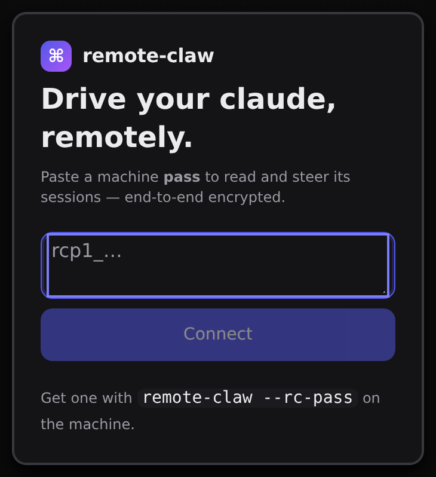 | 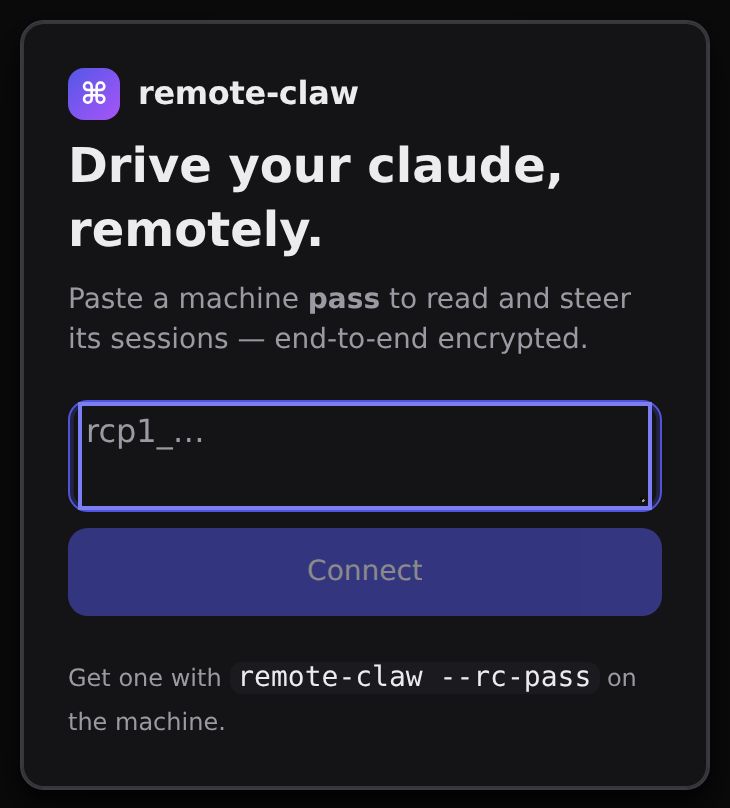 |

The reason is cascade layers, not specificity. `astryx theme build` emits

```css
@layer astryx-theme { .astryx-text.supporting { font-size: var(--text-supporting-size) } }
```

while the `xsm` size class lives in `@layer astryx-base`. A later layer wins regardless of specificity,
so the theme rule beats the size class every time. The `xsm` class is still on the element, which makes
this look like it worked. We only found it by measuring `getComputedStyle` during review; it had already
flattened a deliberate 14px/12.5px hierarchy into a uniform 12px on our entry screen.

**Suggested fix:** emit the size classes into `astryx-theme` too (or into a layer after it), or have
`size` set a custom property the theme rule reads (`font-size: var(--text-size-override, var(--text-…-size))`).
Failing that, document that `size` and a themed `type` don't compose.

### I. `ChatComposerInput` can't host a composer with platform-specific Enter behavior

We migrated the composer's three CONTROLS (Send / Mode / attach) to `Button` / `IconButton` cleanly, but
kept the text input a hand-written `<textarea>`. `ChatComposerInput` is a **contentEditable** `<div>` whose
key handler is (verified in `dist/Chat/ChatComposerInput.js`):

```js
if (e.key === 'Enter' && !e.shiftKey) { e.preventDefault(); … onSubmit?.(text); }
```

That is unconditional — there is no branch for pointer type. Our composer sends on Enter on a **desktop**
but inserts a **newline** on a touch keyboard (a soft-keyboard Return must not strand a multi-line prompt),
and guards IME composition. `ChatComposerInput` would send on Enter on a phone — a real regression — with
no prop to override it. Adopting it would also mean trading our controlled-`value` + auto-grow +
`<textarea>` model for contentEditable + `serialize()`, and fighting its built-in history (ArrowUp/Down)
and trigger menus.

This isn't a complaint — a contentEditable input with token/mention support is a reasonable default for a
chat app. It just isn't a host for an input with bespoke platform behavior, and there's no seam to inject
one. **Suggested fix:** let `ChatComposer` accept a plain controlled `<textarea>` in its `input` slot
without the contentEditable assumptions (today the shell's click-to-focus and submit wiring assume the
default input), or expose an `onKeyDown` / `shouldSubmitOnEnter` hook on `ChatComposerInput`. Until then,
the honest move is what we did: migrate the buttons, keep the input.

### J. `SelectableCard` is a card, not a compact selectable row

Our question card lists answer options as compact toggle buttons (`aria-pressed`, label + optional
description). `SelectableCard` was the obvious candidate — it takes `isSelected`/`onChange` and reflects
`data-selected`, which even matched our test selector. But it renders an `astryx-card` **div** with card
padding, so a three-option question would become three padded cards, roughly tripling the card's height on
a phone, and it swaps toggle-button semantics for card-selection ones.

Not a defect — it's a card component doing card things. But there's a gap between `SelectableCard` (heavy)
and `RadioListItem`/`CheckboxListItem` (a radio/checkbox row, which is close but forces a control glyph we
don't want): **a compact selectable row with a label + description and no radio affordance** has no home.
`Item`/`ListItem` come closest but aren't selection-aware. Suggest either a density prop on
`SelectableCard` or a documented recipe for "selectable row" built from `Item`.

### K. The Chat family assumes symmetric chat; an agent transcript is an asymmetric document

Worth stating since the Chat components were the biggest draw. Our transcript deliberately isn't a
two-sided bubble chat: user turns are small right-aligned pills, assistant turns are full-width prose with
no bubble, and between them sit tool-call rows, diffs, sub-agent threads, thinking blocks and permission
cards. `ChatMessage`/`ChatMessageBubble` model sender-aligned bubbles, which would flatten that hierarchy.

`ChatToolCalls` is the closest fit anywhere in the family — it models status / target / duration /
additions+deletions / `resultDetail`, which is nearly our tool row. We didn't adopt it because our rows
are individually expandable `<details>` inline in the stream, while `ChatToolCalls` groups an array into
one collapsible summary — a different information architecture, not a different style. Suggest documenting
that the Chat family targets messaging-style chat, and that agent/tool transcripts may want `ChatToolCalls`
standalone (it is genuinely reusable on its own).

### L. `Button` has a `destructive` variant but no constructive/success counterpart

Migrating our permission grant/deny buttons, we hit a semantic gap. `Button`'s variants are
`primary | secondary | ghost | destructive`. `destructive` gives a red-tinted button for a dangerous
action — but there is no green/constructive mirror for its opposite. Our permission card colors **Allow**
green and **Deny** neutral-with-red-hover: a deliberate security-UX signal for an irreversible grant, and
a common pattern (approve = green, reject = red).

We could make Allow a `primary` (indigo) Button, but that changes the meaning-color to a brand-color, and
`primary` reads as "the main action" rather than "the safe/affirmative one". So we kept the green/red as a
small semantic tint (`.perm-allow` / `.perm-deny`) layered over Astryx `secondary` Buttons — the chrome
(focus ring, press, disabled a11y, the 44px floor) comes from Astryx; only the meaning-color is app CSS.

**Suggested fix:** a `constructive` (or `success`) Button variant to mirror `destructive`, drawing from
the `--color-success` family the theme already defines. Approve/reject, accept/decline and
confirm/cancel are common enough that a system with `destructive` but no affirmative counterpart pushes
every consumer to either recolor `secondary` by hand (what we did) or misuse `primary`.

### M. The surfaces we KEPT, each with the shipped-source fact that blocks it

Every remaining hand-written surface was assessed against `@astryxdesign/core/dist` (not the docs). These
are hard functional blockers, not taste:

| Surface | Blocking fact (from `dist/`) |
| --- | --- |
| **Session list row** (`button.row`) | `Item`'s root can only be `div`/`li`/`span`, never `<button>`. Moving the StatusDot + needs-badge to `startContent`/`endContent` drops them from the row's accessible name (connection state becomes colour-only) and shrinks the focus target below the 44px floor. |
| **Expandable rows** (`<details>`) | `Collapsible` hides collapsed content with `display:none` — no `hidden="until-found"` anywhere in the package — which **kills Ctrl-F find-in-page** on tool output, diffs and thoughts. Its trigger is a baked large/semibold/primary `<button>` with no theming hook. |
| **Diff viewer** (`.diff` / `.dl-add` / `.dl-del`) | `highlightLines` is a flat `number[]` → one internal `Set` → the single `--color-accent-muted` wash for *every* listed line, so `+` and `−` lines tint **identically**, with no per-sign colour and no `+`/`−` marker. (0.1.8 *does* have a `title` string label and a `maxHeight` scroll cap / `isCollapsible` whole-block collapse, so those aren't the blocker — the single highlight class is.) Confirmed upstream, with a live side-by-side: [facebook/astryx#3345](https://github.com/facebook/astryx/issues/3345). |
| **Tool output** (`.tool-output`) | `CodeBlock` creates one `<div>` per line with no windowing, so a large log still builds every node and tokenizes every line — though once a block reaches 100 lines 0.1.8 lets *offscreen* lines skip layout/paint (`content-visibility:auto` on 20-line chunks) and caps the visible extent (`maxHeight` scroll cap / `isCollapsible` collapse). For raw stdout that needs none of its tokenizer/copy/card, a plain `<pre>` stays lighter. |
| **Sheet rows** (`.mode-row`) | No row component (`Item` / `DropdownMenuRadioItem` / `RadioListItem`) puts the selected/pressed state on the *focusable* element — `Item`'s `aria-selected` lands on a role-less `<div>` and is dropped by assistive tech. |
| **Status strip** (`.chat-status`, `.transcript-gap`) | `Banner` has no neutral/ambient status (`info` forces a blue fill), its status map is type-only so a custom status **silently drops `role`** (an a11y regression), and its header floor is +34% on our ~33px pinned one-line strip. (The error banners, which ARE alerts, did migrate — finding above.) |
| **Other badges/chips** (`.agent-badge`, `.perms-bypassed`, git chip, `.cmd-chip`, `.pill`) | `Badge` has no border/outline variant; `Token` doesn't rest-spread (drops `title`/`data-*`) and has no tooltip; `ChatMessageBubble` omits `white-space:pre-wrap`, collapsing newlines in multi-line messages. |
| **Empty hints** (`.empty`, `.empty-pad`) | `EmptyState` requires a `title`, rendered semibold/primary — adopting it would force inventing a heading and brightening the body, i.e. a copy/visual redesign for ~7 lines. A faint one-line hint isn't an empty-state moment. |

Upstream asks implied above, most valuable first: a `<button>`-rootable selectable list item that keeps
state on the focusable element; `hidden="until-found"` (or a find-in-page-safe collapse) on `Collapsible`;
per-sign colours (or a diff mode) on `CodeBlock` ([facebook/astryx#3345](https://github.com/facebook/astryx/issues/3345));
a neutral/ambient `Banner` status; a border/outline `Badge` variant.

The `CodeBlock` diff limitation is the one that renders as a screenshot. The same config edit, both ways:
the real `<CodeBlock highlightLines={[3,4,5,6]}>` washes all four changed lines with the one
`--color-accent-muted`, so the highlight itself doesn't distinguish add from remove (and carries no
`+`/`−`), while the renderer we kept marks deletions red with `−` and additions green with `+`. This is the visual behind [#3345]:

| CodeBlock vs. our diff viewer — light | dark |
| --- | --- |
| 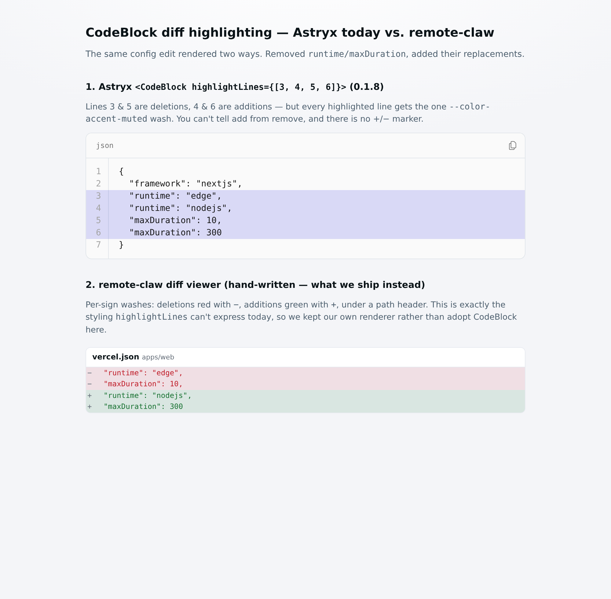 | 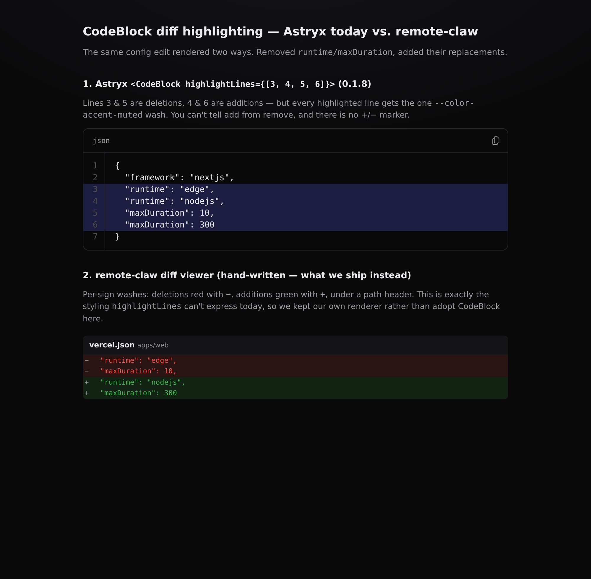 |

[#3345]: https://github.com/facebook/astryx/issues/3345

### N. `Dialog` for the sheet shell — investigated, then KEPT (the bug it would fix isn't real here)

The assessment flagged our bottom-sheet `Sheet` as worth migrating to `Dialog`, on the grounds that our
scroll-lock is broken: `document.body.style.overflow = "hidden"` is indeed a **no-op**, because the
scroller in this layout is `.transcript` / `.sessions` (`flex:1; overflow-y:auto`), not `<body>`. So far
so true — and `Dialog`'s `useScrollLock` (which pins `body{position:fixed}`) looked like the fix.

Then we **reproduced it instead of assuming**, and the premise fell apart. With a genuinely tall
transcript and a sheet open, scrolling the background does **not** leak — on Chromium (a wheel over the
transcript moves nothing) and on WebKit, the iOS-faithful engine (the `.sheet-layer` overlay —
`position:fixed; inset:0; z-index:50`, with the scrim as its visible part — is the `elementFromPoint` over
*every* point of the transcript's rectangle). The overlay already prevents scroll-behind; the body lock
was a no-op that never mattered, and `Dialog`'s `body{position:fixed}` wouldn't have reached our nested
scroller either. So `Dialog` would have added a scroll-lock for a non-bug, at medium risk with a long
footgun list (conditional-mount, anchor-in-onClick, explicit `role`, zeroed `::backdrop` blur), for a
marginal gain (`showModal()` inertness over a Tab-trap that works and is tested).

**Outcome:** KEEP the `Sheet`, and remove the dead no-op body lock (a comment that claimed to "lock
background scroll" while doing nothing is worse than no code). The real mechanism — the full-viewport
overlay covering the scroller — is now pinned by a bite-validated test ("an open sheet's scrim covers the
whole transcript region"): with `pointer-events:none` on the overlay, every sampled point leaks to the
transcript and the test goes red. This is the honest end of the "reproduce, don't assume" rule — the one
KEEP-adjacent surface the assessment wanted migrated turned out not to need it.

### O. Minor CLI papercuts

- `astryx docs --list` errors with `unknown option '--list'`, even though bare `astryx docs` prints exactly
  that list and `astryx component --list` / `astryx template --list` both exist. The inconsistency sent us
  looking for a subcommand that isn't there.
- `astryx hook --json` returned a payload our generic walker found no names in, while
  `astryx component --list --json` worked first try. Worth checking the two share a shape.
- `@astryxdesign/cli` declares `@astryxdesign/lab` and `@astryxdesign/charts` as peer dependencies. Neither
  is mentioned in the docs and pnpm warns about both on install.

### P. Weight, for awareness rather than complaint

`@astryxdesign/core@0.1.8` unpacks to **15.5 MB across 2 440 files**, and `dist/astryx.css` is **127 KB**
uncompressed and loaded in full regardless of which components a page uses. For a viewer whose primary
device is a phone on a hotel network, that is the one number we are watching. Per-component CSS splitting
(or a documented way to subset the stylesheet) would matter to us before we ship this to production.

Measured on the shipped build: the route links **~154 KB of CSS raw / ~30 KB gzipped**, of which
`astryx.css` is ~119 KB raw / ~22 KB gz — carrying every component's styles while we render ~12. Before
the migration the hand-written stylesheet was a few KB gzipped, so first-load CSS grew roughly 5×. In
absolute terms 30 KB gzipped is still modest, but the whole-library stylesheet is the dominant term and it
doesn't shrink as we adopt fewer components — which is exactly why subsetting would help.

---

## The design pass — what a component migration does NOT give you

Composing the right components correctly still produced a screen that read, in the reviewer's words, as
"poop with two highlights": one flat dark mass with exactly two bright spots. Every test was green and
every component was the correct one. The problems were all in the SPACE between components, which no
component owns:

| before | after |
| --- | --- |
| 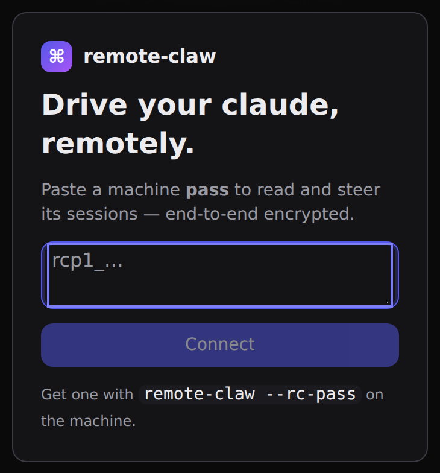 |  |

Measured, not eyeballed (`tests/web/zoom/metrics.json`):

| symptom | measurement | fix |
| --- | --- | --- |
| The card had no presence | card `#141417` vs page `#0a0a0b` = **1.14:1**, `box-shadow: none` | `--shadow-high` on the entry card. Astryx's Card has no elevation prop, and on a near-black palette a surface step alone is invisible. |
| The primary CTA was small | **32px** tall (`size="md"`), under the 44px touch minimum | `size="lg"` (36px) plus an app-level `min-height: 44px` floor |
| The stack read as undifferentiated | gaps `[12, 12, 12, 12]` — brand, headline, copy, field, button and hint all spaced identically | nested `VStack`s: **20px** between groups, **8px** within |

The lesson we'd pass on: a design system gives you correct components and correct tokens. It does not
give you **elevation choices, touch-target policy, or grouping rhythm** — those stay the app's job, and
they are exactly what makes the difference between "the components are right" and "the screen is right".
This is also why the harness measures geometry rather than only capturing pictures: "padding looks fine"
is not a finding, but `padding: 8px 12px` on a 32px primary CTA is.

## Things we got wrong (not Astryx's fault, recorded so others don't repeat them)

- **Our leftover global element resets silently restyled the design system's components.** The migration
  layer (`remote-claw`) is declared LAST so hand-written rules keep winning while surfaces migrate — which
  also means a BARE ELEMENT selector in it hits every Astryx component built from that element. Two rules
  we had carried for years did real damage:

  | rule (ours, last layer) | effect on Astryx |
  | --- | --- |
  | `button { font: inherit; cursor: pointer }` | `Button` rendered at 16px/400 instead of 14px/500 |
  | `code { font-size: 0.86em; … }` | `<Code>` rendered at **10.32px** with the wrong padding and radius |

  | | before — our global rule winning | after — the component's own styling |
  | --- | --- | --- |
  | `Button` | 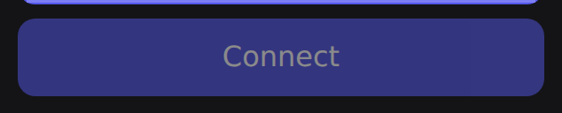 | 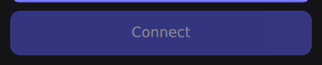 |
  | `Code` | 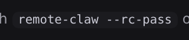 | 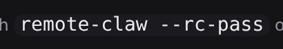 |

  Both were already provided by Astryx's own reset — at zero specificity in `@layer reset`, exactly where
  a reset belongs — so ours were redundant *and* harmful. Nothing failed; the components simply looked
  wrong, and we only caught it by diffing `getComputedStyle` with and without our rules. If you adopt
  Astryx into an app with an existing stylesheet, audit it for bare element selectors first. We now have a
  test that fails on any bare element selector in the migration layer.

- We initially fanned out ~240 agents to scrape the docs site. The CLI made all of it redundant. **Check
  for `astryx docs` first.**
- We reached for `xstyle` before reading `astryx docs styling` to the end. On Next.js App Router,
  authoring your own StyleX requires an SWC-based transform; `className` plus token-backed CSS avoids the
  whole question. For an app that already has a stylesheet, `className` + `var(--token)` is the
  lower-friction path and interoperates fine.

---

## How we verify each step

1. `pnpm run build` — the real production webpack build.
2. `vitest run` — includes `test/astryx-foundation.test.ts`, which asserts against the **emitted** CSS:
   layer order declared once and sorted first, every legacy rule inside `@layer remote-claw`, both Astryx
   layers present, the theme's `@scope` attribute matching, and no remote `url()`/`@font-face`.
3. `playwright test -c app-e2e.config.ts` — the existing browser suite, driving a real Chromium against a
   real Next server, a real broker and a real host process.
4. `playwright test -c app-e2e.shots.config.ts` — 11 surfaces × {phone, desktop} × {light, dark},
   captured before and after each step and compared (both colour modes since the light-mode work).
5. `codex exec` as an independent reviewer on the diff.

Each guard is **bite-validated**: we break the thing on purpose and confirm the test fails before trusting
it. The cascade-layer guard was validated this way — removing the `@layer` wrapper turns it red with
`viewer.css lost its @layer wrapper`.
